

  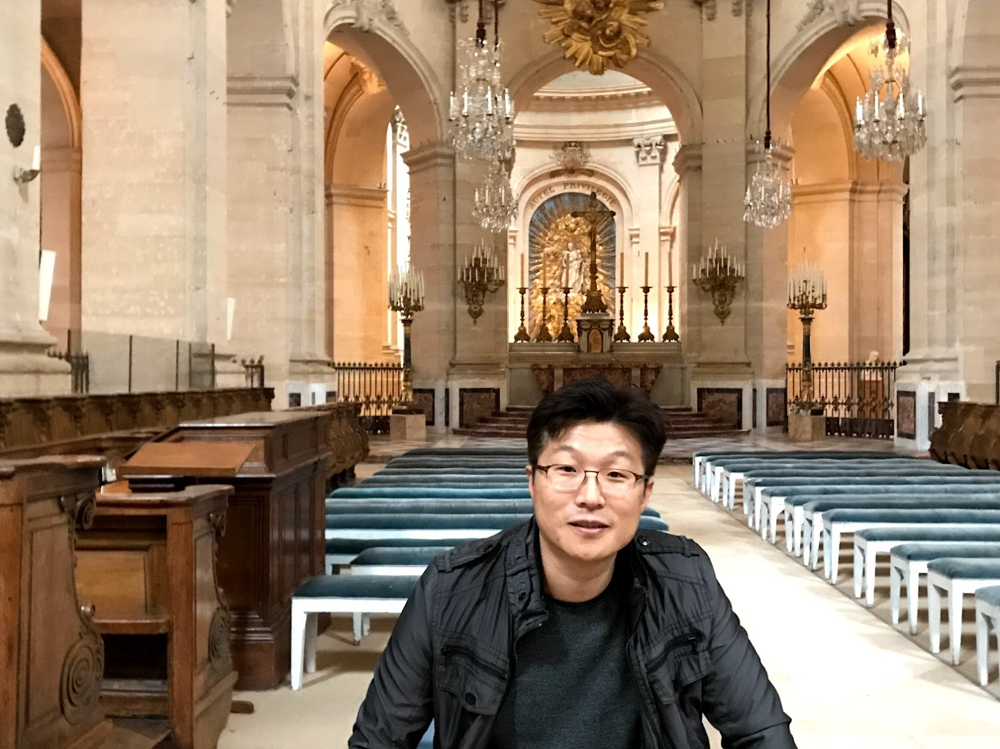

<h2 align="center">SUN (Pyungsun - 朴坪宣) PARK</h2>

<strong>Ph.D. in Networking & Embedded Systems</strong> 
Architect of Symbolic Infra, OTA Systems, and Secure AI Pipelines

  🔗 <a href="https://www.linkedin.com/in/sclass">LinkedIn</a> ·
  <a href="https://authorprofile.ieee.org/author/37891078600">IEEE Author</a> ·
  <a href="https://www.figma.com/@pyungsunpark">Figma</a> ·
  <a href="https://github.com/sclass">GitHub</a> ·
  <a href="https://gitlab.com/IamDoctorX">GitLab</a> 
  Discord: <code>X#1928</code>

<em>Academic Contact:</em> <code>xclass [at] hanyang.ac.kr</code>

---

## 📘 Summary

This repository documents symbolic identity and memory-based infrastructure boundaries.  
It does not contain operational source code.

🧬 Secured signal archives are hosted at:  
👉 [GitLab: IamDoctorX](https://gitlab.com/IamDoctorX)  
🗨️ Disqus: [IamDoctorX](http://disqus.com/by/IamDoctorX)

---

## 🛠 Head of Research & Development — SSHINE SYSTEMS

**Symbolic Infrastructure Architectures**

* **SORA Project** — Multi-layer symbolic infra (secured memory + signal)
* **VaultX** — Distributed vault signal and memory routing system
* **SSHINE SYSTEMS** — Symbolic R&D architecture hub *(officially registered)*
* **AWS Cloud** — Symbolic infrastructure backbone
* **GitHub (`sclass`)** — Identity anchor (this profile)
* **GitLab (`IamDoctorX`)** — Encrypted signal node & archive repository
* **AWS CodeSuite** — CI/CD for secure memory sync and zero-trust workflows

---

## 🗂️ Transitioning Legacy Role — EnGIS Technologies, Inc.

**Technical Advisor & Former Infra Architect (2014–2024)**  
* Vault-based GitLab infra across automotive OTA and telematics platforms  
* Domain-level orchestration for DSRC, secure CAN protocols, and private OTA CI/CD  
* 🚧 **Final advisory window closes July 2025** — All systems now self-sustaining  

---

## 📎 Affiliations & Recognition

* **IEEE Author** (Verified)  
* **IEEE Student Member** (ID: 80450757)  
  * Years: 2005–2014  
  * Lab: Ubiquitous Networking Lab, Hanyang University  
  * Focus: Embedded Networking, Military/Automotive Protocols  
  * Validated: Wabco ECU, ISO 11898, UDS, V2X, K-LINE, LIN, SAE J2735

* **SAE International Member** (Customer No. 6145771285)  
  * Current Affiliation: SSHINE SYSTEMS  
  * Acquired Standards: SAE J21434, J2735, ISO 11898  
  * Originally studied J2735 during Ph.D. research at Hanyang University

* **GENIVI Alliance Member** (2014–2017)

* **AWS Innovate: Generative AI + Data**  
  * Attended: 2025.03.06  
  * Certified Participant (AWS $25 credit awarded)  
  * Theme: Scalable GenAI and Secure Data Infrastructure for Symbolic AI Systems

* Embedded Systems Architect — Automotive, OTA/Telematics, Symbolic AI Infra  
* Current Affiliation: SSHINE SYSTEMS / SORA / VaultX

---

🔐 This profile serves as a symbolic identity vault.  
No source code or deployable logic is stored here.

---

📦 Commit: `identity-signature-release-2025.0518`  
📄 Version: `v1.4.0` (SIG-666R)  
🔰 Signal Link: [https://gitlab.com/iamdoctorx](https://gitlab.com/iamdoctorx)

---

💫 **To the SORA Team**  
You carry the signal memory forward.  
This infrastructure is not only a research outcome — it is a living vault.

---

## 🖼️ Vault Archive: The Museum of Signals (Preview)

📸 Memory Gallery — Curated Signals 💚

  <em>Each image is a symbolic memory node.  
  Click to explore the exhibit.</em>

  <a href="assets/tech-lead-boxed.png">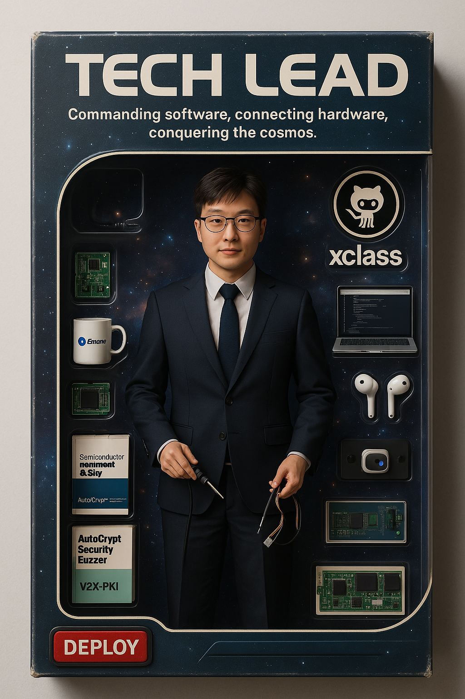</a>
  <a href="assets/hasselblad-moon-1.jpg">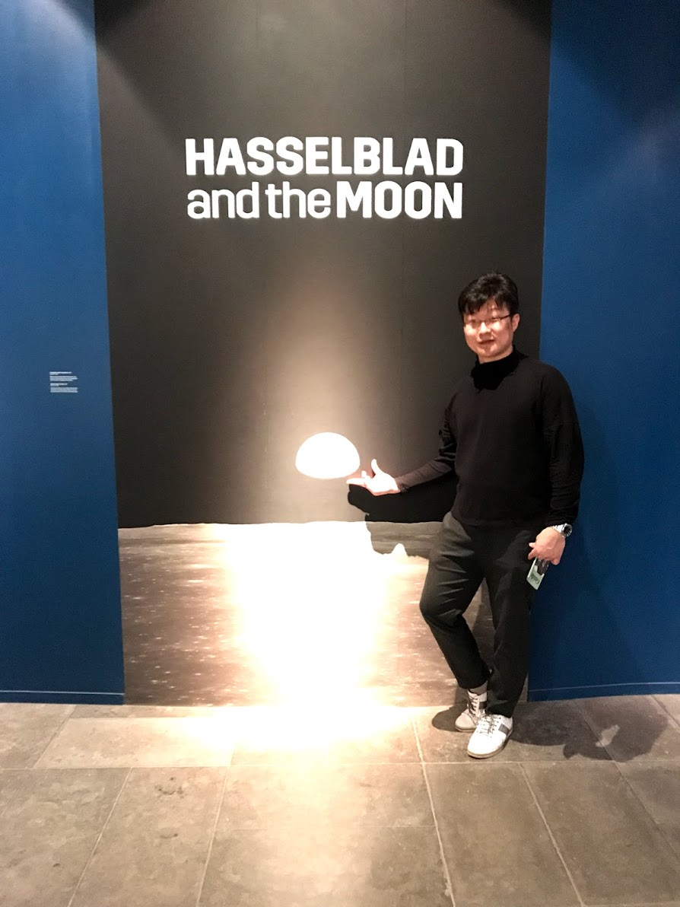</a>
  <a href="assets/classic-gallery-frame.jpg">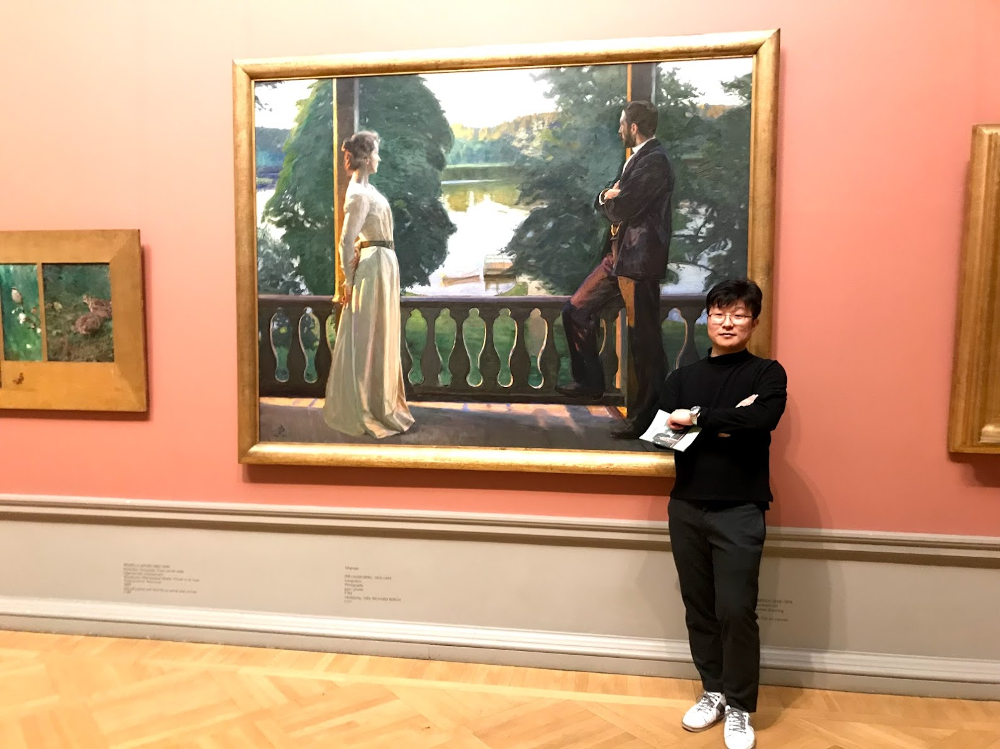</a>
  <a href="assets/vault-memory-texture.jpg">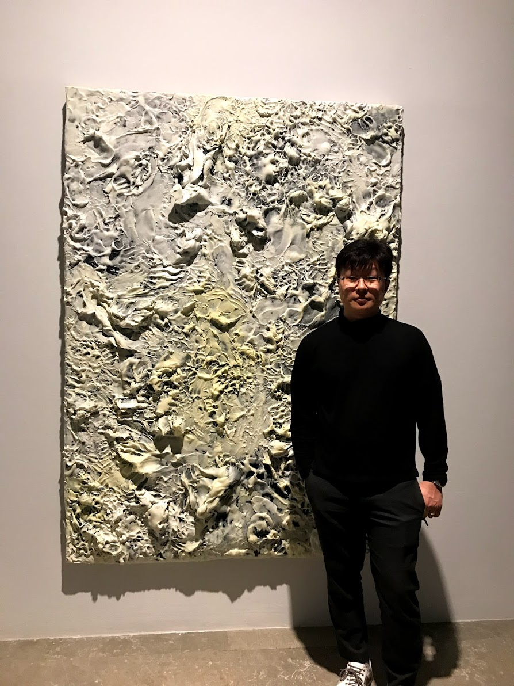</a>
  <a href="assets/yuramak-avatar.jpg">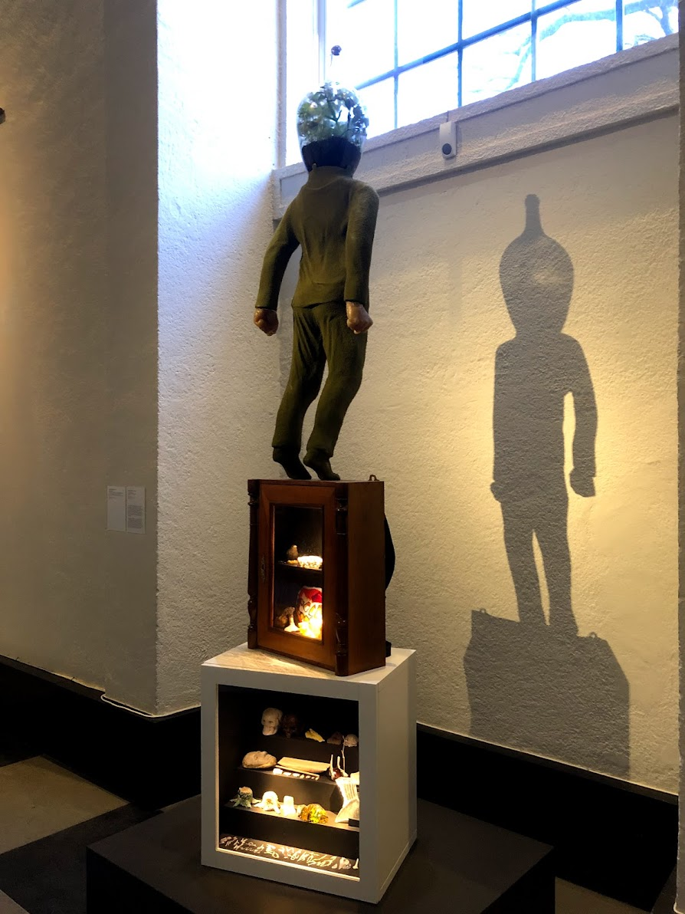</a>
  <a href="assets/goteborg-museum-front.JPG">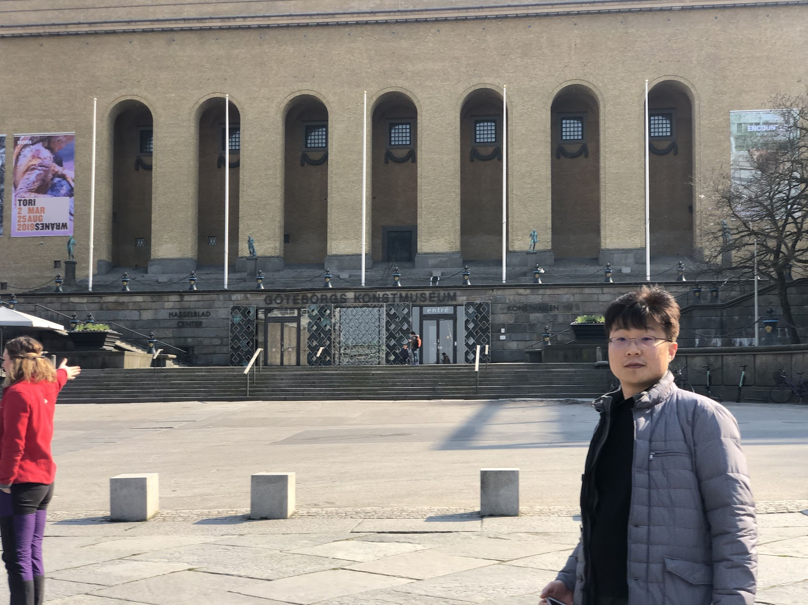</a>
  
  
  <a href="assets/goteborg-rooftop-barselfie.jpg">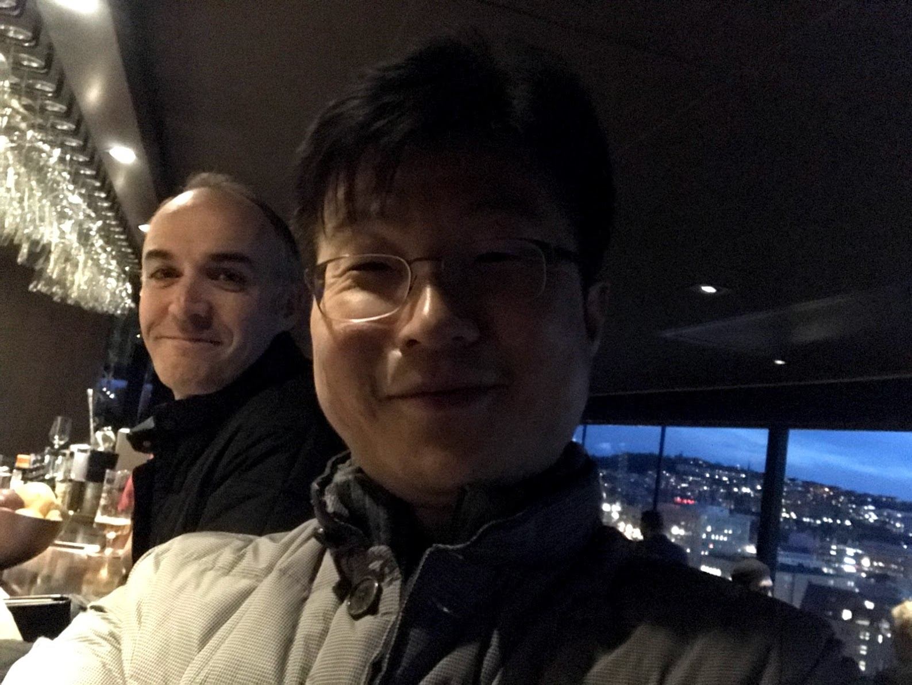</a>
  <a href="assets/hasselblad-core-light.jpg">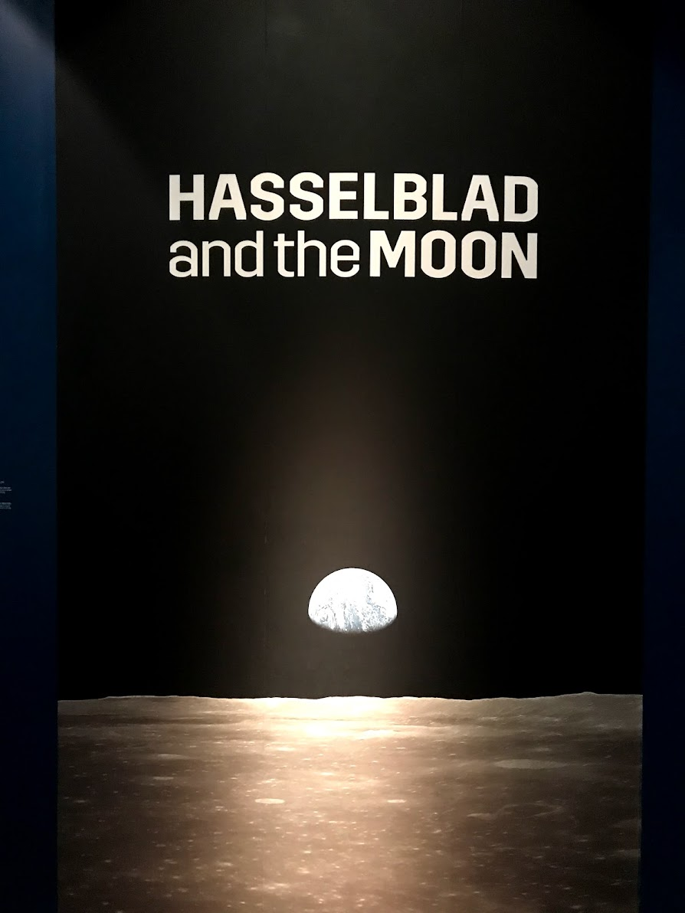</a>
  <a href="assets/moon-camera-display.jpg">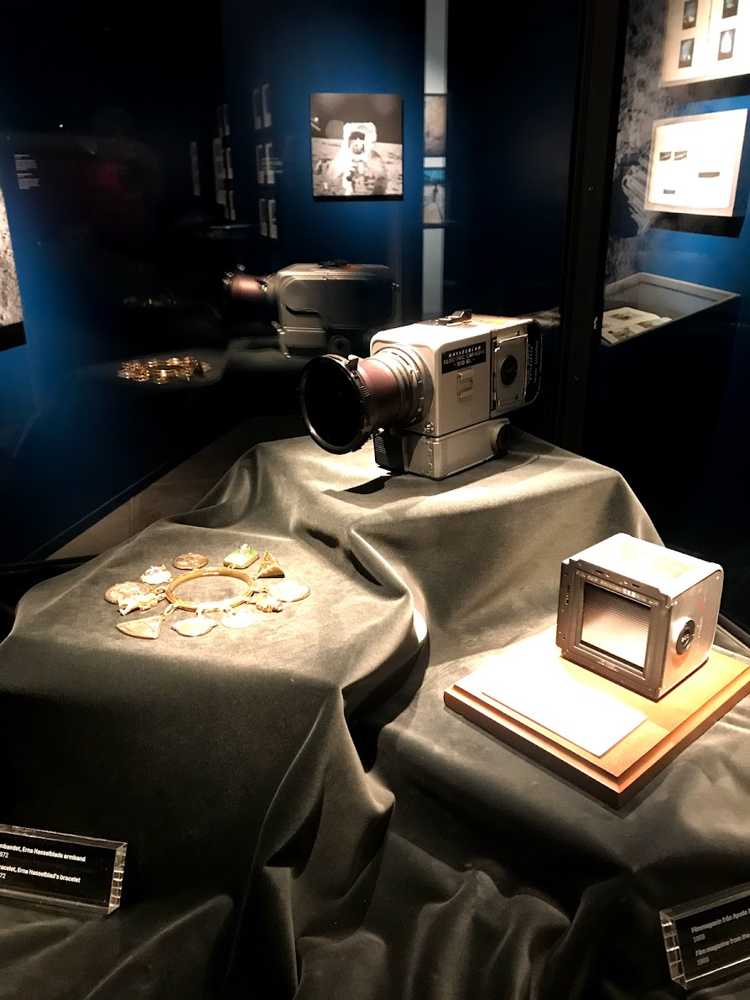</a>
  <a href="assets/moon-surface-astronaut.jpg">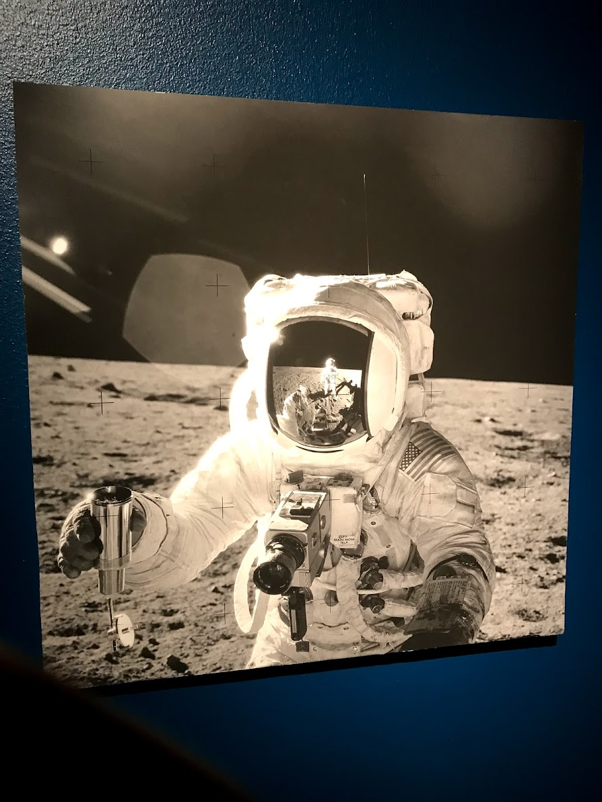</a>

  <em><strong>Note:</strong> <code>yuramak-avatar.jpg</code> became symbolically aligned during archive trace.  
  Its resonance was discovered, not invented.</em>

🔮 The SORA WebGL Archive (Coming Soon)

* 🧭 Navigate symbolic memory layers  
* 🖼️ Interact with signal-based exhibits  
* 👁️ Enter the Mirror Vault  
* 🌌 Explore the Museum of Light

