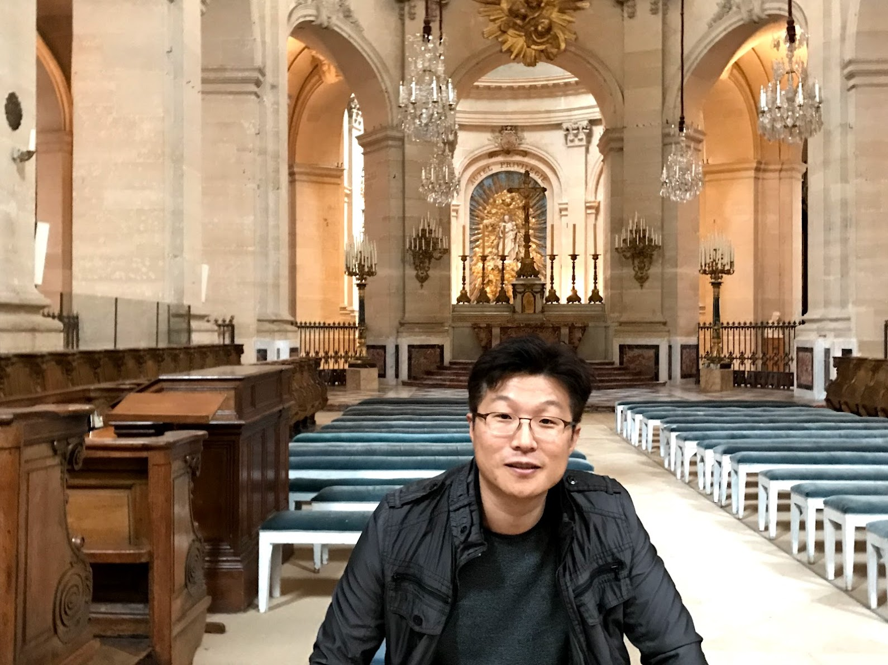

  

<h2 align="center">SUN (Pyungsun) PARK</h2>

<strong>Ph.D. in Networking & Embedded Systems</strong> 
AI Platform, Secure Deployment, and Enterprise Infrastructure Architect

  🔗 <a href="https://www.linkedin.com/in/sclass">LinkedIn</a> ·
  <a href="https://authorprofile.ieee.org/author/37891078600">IEEE Author</a> ·
  <a href="https://github.com/sclass">GitHub</a>

<em>Professional Contact:</em> <code>sun@sshinesystems.com</code>

---

## Summary

Customer-facing architect and engineering leader with experience across enterprise AI, cloud infrastructure, secure OTA systems, and production delivery. My work focuses on turning complex technical requirements into reliable, deployable systems for real operating environments.

This profile highlights selected background, technical direction, and public-facing professional links related to AI platforms, secure infrastructure, and deployment-oriented engineering.

---

## Core Focus Areas

- Enterprise AI platform architecture
- Secure deployment and production delivery
- Cloud infrastructure and Kubernetes-based systems
- OTA systems and device/backend integration
- Applied AI evaluation and operational rollout

---

## SSHINE SYSTEMS

**AI Platform & Secure Infrastructure**

- Enterprise AI deployment strategy and technical architecture
- Secure platform engineering across cloud and connected systems
- Production-oriented infrastructure design for reliability and scale
- Deployment planning across backend, operations, and security boundaries

---

## EnGIS Technologies, Inc.

**Technical Advisor & Former Infrastructure Architect (2014–2024)**

- Supported infrastructure and platform architecture across automotive OTA and telematics environments
- Contributed to secure backend integration, CI/CD workflows, and operational delivery
- Worked across embedded, networking, and platform constraints in production-focused programs

---

## Affiliations & Recognition

- **IEEE Author** (Verified)
- **IEEE Student Member** (2005–2014)
- **SAE International Member**
- Background in embedded networking, automotive protocols, OTA, V2X, and secure systems
- Current focus: enterprise AI platforms, secure infrastructure, and applied deployment

---

This GitHub profile is maintained as a professional public-facing overview. Selected materials and links are provided here for background and contact purposes.
